<!-- Custom Terminal Header (Self-Hosted SVG in repo - zero broken images!) -->
<div align="center">
  
</div>

<br/>

### 🧑‍💻 About Me

```javascript
const shehzad = {
  code     : ["JavaScript", "TypeScript", "Python"],
  technologies : {
    frontEnd : ["React", "Next.js", "TailwindCSS"],
    backEnd  : ["Node.js", "Express", "MongoDB", "PostgreSQL"]
  },
  currentFocus : "Building high-performance full-stack web applications",
  philosophy   : "Write clean, readable, and maintainable code ⚡"
};
```

- 🔭 Currently building modern web apps with **React & Next.js**
- 🌱 Exploring cloud architecture & scalable backend services
- 💬 Ask me about **JavaScript, Frontend Architecture & Full-Stack Dev**
- ⚡ Fun fact: *Eat, Sleep, Code, Debug, Repeat*

---

### 🛠️ Tech Stack & Tools

<div align="center">
  <!-- Pure icons without text badges -->
  
</div>

---

### 📊 GitHub Stats & Streak

<div align="center">
  
</div>

<br/>

<div align="center">
  
</div>

---

### 🐍 Contribution Activity

<div align="center">
  
</div>

---

### 🌐 Connect With Me

<div align="center">
  <a href="https://linkedin.com/in/your-linkedin">
    
  </a>
  <a href="https://twitter.com/your-twitter">
    
  </a>
  <a href="mailto:your-email@example.com">
    
  </a>
</div>

<br/>

<div align="center">
  
</div>
